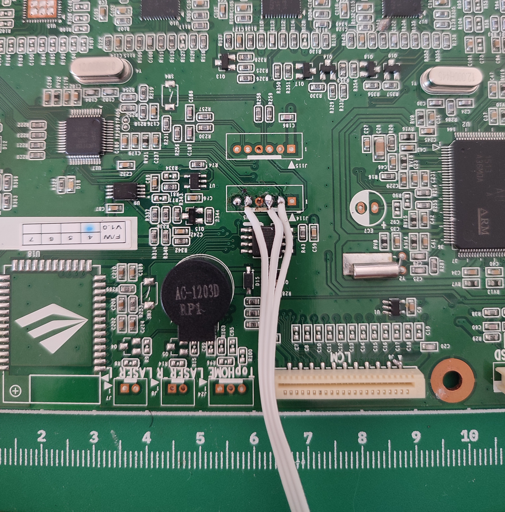
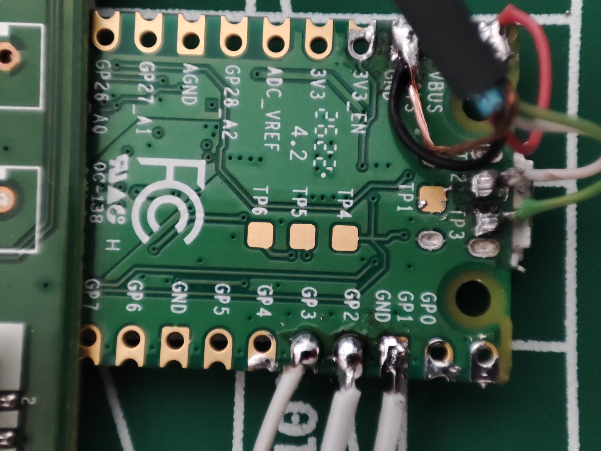
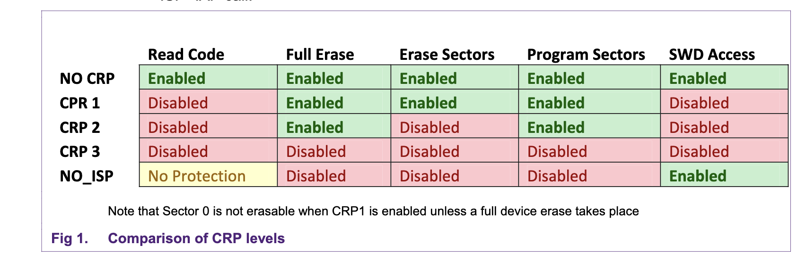
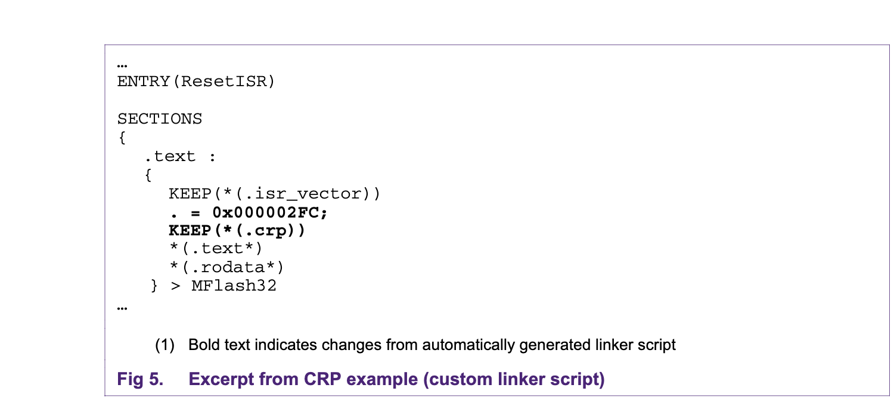
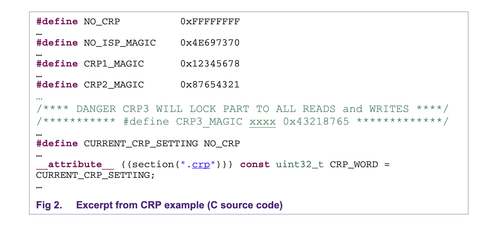
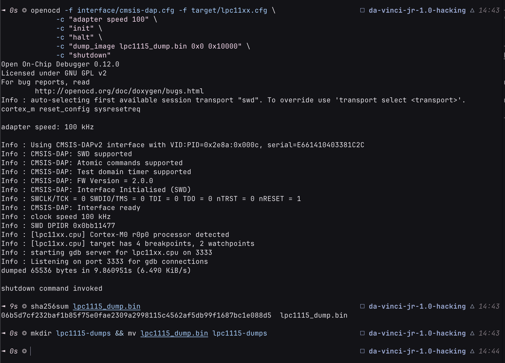
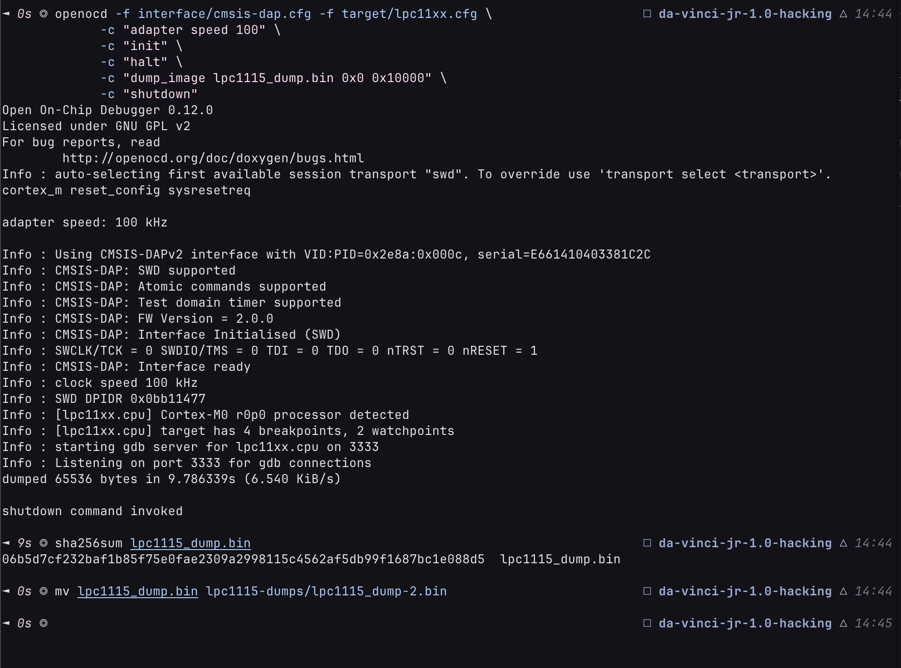

# Firmware Dumping

There are 4 chips that we can dump the firmware of:

- SAM4E8E (main mcu)
- LPC1115 (secondary mcu)
- MX25L3206E (flash memory on main board)
- AT24C02D (EEPROM on hotend)

Dumping before doing anything is very strongly suggested, since this is a very experimental project and any mistakes can be very difficult to recover from. Having a working dump for each chip is essential for debugging and recovery.

## LPC1115

To dump the LPC1115 firmware, we need:

- HW: SWD debugger: A Pi Pico works perfectly too.
- HW: soldering iron
- SW: OpenOCD

### Getting Started

Firstly, make sure you have [OpenOCD](https://openocd.org/) installed on your computer. I am using version 0.12.0

Then, flash the pico with [DebugProbe firmware](https://github.com/raspberrypi/debugprobe/releases). Download the "on_pico.tf2" version according to your pico version (pico v1.0 vs pico v2.0). I am using v2.3.1

Hold the bootsel button on the pico while plugging it in, and release after a few seconds. Make sure you see a ~128MB drive appear, and drag and drop the firmware file onto it. It will automatically disconnect, dont worry, its normal

After the firmware is flashed, check that its recognized:

```shell
openocd -f interface/cmsis-dap.cfg -f target/lpc11xx.cfg -c "init" -c "shutdown"
```

> If you see `Error: unable to find a matching CMSIS-DAP device`, check your USB connection to the pico and try again.

If the device is recognized, you should see something like:

```shell
Info : Using CMSIS-DAPv2 interface with VID:PID=0x2e8a:0x000c, serial=E661410403381C2C
Info : CMSIS-DAP: SWD supported
Info : CMSIS-DAP: Atomic commands supported
Info : CMSIS-DAP: Test domain timer supported
Info : CMSIS-DAP: FW Version = 2.0.0
Info : CMSIS-DAP: Interface Initialised (SWD)
Info : SWCLK/TCK = 0 SWDIO/TMS = 0 TDI = 0 TDO = 0 nTRST = 0 nRESET = 1
Info : CMSIS-DAP: Interface ready
Info : clock speed 10 kHz
Error: Error connecting DP: cannot read IDR
```

> The error is normal, as the device is not connected to the board yet.

If everything until this point is working, continue by finding the J114 connector on the board. It should be located between the MCU's, and next to the buzzer and the flash memory.



Find the pin 1 (on my board, its square shaped and has a small '1' printed next to it). Then, solder the wires according to this table:

| Board pin | Pin description | SWD pin | Pico pin |
| :-------: | :-------------: | :-----: | :------: |
|     1     |       5V        |    -    |    -     |
|     2     |      SWDIO      |  SWDIO  |   GP3    |
|     3     |       GND       |   GND   |   GND    |
|     4     |       GND       |    -    |    -     |
|     5     |     SWDCLK      | SWDCLK  |   GP2    |
|     6     |      RESET      |    -    |    -     |

> _Huge thanks to pyr0ball for this schematic: [SWD pinout](https://github.com/Duet3D/RepRapFirmware/issues/190#issuecomment-403314752)_



At this point, you should have a Pico with the SWD pins connected to the board. If you are using a different board, you can refer to the SWD pin column instead.

> Do NOT connect the SWD pins to the pico's pins marked 'SWDIO', 'SWDCLK' etc, they are for debugging the pico itself, and you will end up spending too much time chasing ghosts (dont ask how i know)

Double check the connections and make sure there are no shorts or wrong connections! They can cook your printer board, your debugger, or your computer!

### Verifying the Connection

After you are sure everything is correct, continue by connecting the printer board to power, and the pico to your computer. Check the connection again:

```shell
openocd -f interface/cmsis-dap.cfg -f target/lpc11xx.cfg -c "init; exit"
```

If the connection is correct, you should see output like this:

```shell
Info : Using CMSIS-DAPv2 interface with VID:PID=0x2e8a:0x000c, serial=E661410403381C2C
Info : CMSIS-DAP: SWD supported
Info : CMSIS-DAP: Atomic commands supported
Info : CMSIS-DAP: Test domain timer supported
Info : CMSIS-DAP: FW Version = 2.0.0
Info : CMSIS-DAP: Interface Initialised (SWD)
Info : SWCLK/TCK = 0 SWDIO/TMS = 0 TDI = 0 TDO = 0 nTRST = 0 nRESET = 1
Info : CMSIS-DAP: Interface ready
Info : clock speed 10 kHz
Info : SWD DPIDR 0x0bb11477
Info : [lpc11xx.cpu] Cortex-M0 r0p0 processor detected
Info : [lpc11xx.cpu] target has 4 breakpoints, 2 watchpoints
Info : starting gdb server for lpc11xx.cpu on 3333
Info : Listening on port 3333 for gdb connections
```

> If there are any problems, you can try decreasing the clock speed:
>
> ```shell
> # For 1 kHz:
> openocd -f interface/cmsis-dap.cfg -f target/lpc11xx.cfg -c "adapter speed 1" -c "init" -c "shutdown"
> ```

### Checking for CRP (Code Readout Protection)

At this point, you should have your computer successfully communicating with the printer board over the SWD interface.

Here, we check for CRP (Code Readout Protection) before attempting to dump the firmware.

> **What is CRP?**
>
> Code Readout Protection is a security feature that prevents the firmware from being read out of the device.
> Good for protecting IP, bad for reverse engineering or backing up the firmware.
>
> 
> _Source: [NXP Application Note AN10968](https://www.nxp.com/docs/en/application-note/AN10968.pdf)_
> More information can be found at: [UM10398](https://www.usr.cn/Uploads/Attach/201010/user.manual.lpc11xx.lpc11cxx.pdf) (3. party link due to NXP having the link behind a login, the original can be found here: [NXP UM10398](https://www.nxp.com/webapp/Download?colCode=UM10398&location=null))

```shell
openocd -f interface/cmsis-dap.cfg -f target/lpc11xx.cfg -c "init" -c "halt" -c "mdw 0x2FC" -c "shutdown"
```

You should see output like this:

```shell
[lpc11xx.cpu] halted due to debug-request, current mode: Handler External Interrupt(24)
xPSR: 0x81000028 pc: 0x0000375a msp: 0x10001f84
0x000002fc: e7fee7fe

shutdown command invoked
```

The part after the '0x000002fc' in the output is the CRP level, which indicates the level of protection the device is using. It has some magic byes that indicate the level of protection as mentioned above in the 'What is CRP?' section.

| Location of the magic bytes on the chip (0x000002fc) | Possible values for the CRP magic bytes        |
| ---------------------------------------------------- | ---------------------------------------------- |
|      |  |

> _Source: NXP Application note AN10968 (mentioned above)_

Here, i got 'e7fee7fe' as the CRP level, which is not a valid CRP level. This means the device is not protected by CRP, and the firmware can be dumped without any restrictions.

> **I got CRP level >=1, what should i do!?**
>
> I have absolutely no idea. You can try erasing the magic bytes since the firmware still allows erasing/writing in CRP1, but it doesnt use SWD. If you have CRP2, you have no way other than full erase (i think). If you have CRP3, just throw that chip in the bin and move on as that is the best you can do to preserve your sanity.
>
> Jokes aside, you should still be able to bypass the chip and directly solder the heater pins etc to the main MCU and ignore the LPC chip completely.

### Dumping the Firmware

At this point, you should have verified that CRP is not enabled, and the connection is solid. You can now proceed to dump the firmware.

```shell
openocd -f interface/cmsis-dap.cfg -f target/lpc11xx.cfg \
  -c "adapter speed 100" \
  -c "init" \
  -c "halt" \
  -c "dump_image lpc1115_dump.bin 0x0 0x10000" \
  -c "shutdown"
```

And you should see output similar to the following:

```shell
adapter speed: 100 kHz

Info : Using CMSIS-DAPv2 interface with VID:PID=0x2e8a:0x000c, serial=E661410403381C2C
Info : CMSIS-DAP: SWD supported
Info : CMSIS-DAP: Atomic commands supported
Info : CMSIS-DAP: Test domain timer supported
Info : CMSIS-DAP: FW Version = 2.0.0
Info : CMSIS-DAP: Interface Initialised (SWD)
Info : SWCLK/TCK = 0 SWDIO/TMS = 0 TDI = 0 TDO = 0 nTRST = 0 nRESET = 1
Info : CMSIS-DAP: Interface ready
Info : clock speed 100 kHz
Info : SWD DPIDR 0x0bb11477
Info : [lpc11xx.cpu] Cortex-M0 r0p0 processor detected
Info : [lpc11xx.cpu] target has 4 breakpoints, 2 watchpoints
Info : starting gdb server for lpc11xx.cpu on 3333
Info : Listening on port 3333 for gdb connections
[lpc11xx.cpu] halted due to debug-request, current mode: Handler External Interrupt(24)
xPSR: 0x6100000f pc: 0x00002bac msp: 0x10001f88
dumped 65536 bytes in 9.850773s (6.497 KiB/s)

shutdown command invoked
```

> If your connection cannot handle the speed, you can decrease the `adapter speed` value, which will slow down the connection but may be necessary.

At this point, you should have a `lpc1115_dump.bin` file in your current directory.

> **Optional but strongly recommended**: Dump the firmware multiple times (at least 3 times) by renaming the output file. Then, use sha256sum to make sure the dumps are identical. For example:
>
> | Dumping the firmware for the first time, and hashing the output file | Dumping the firmware for the second time, and hashing the output file |
> | -------------------------------------------------------------------- | --------------------------------------------------------------------- |
> |      |      |

If you have dumped the firmware, i would appreciate it if you could open a github issue with the sha256sum of your dump attached, in case its different. Sharing the firmware dump itself _on github_ is problematic due to takedown risk.

**SHA256: `06b5d7cf232baf1b85f75e0fae2309a2998115c4562af5db99f1687bc1e088d5`**

### Preserving the firmware dump

Make sure to preserve the firmware dump in a secure location, and try to back it up on different media (e.g. USB drive, external hard drive, cloud storage, etc.) in case you need to recover it later.
