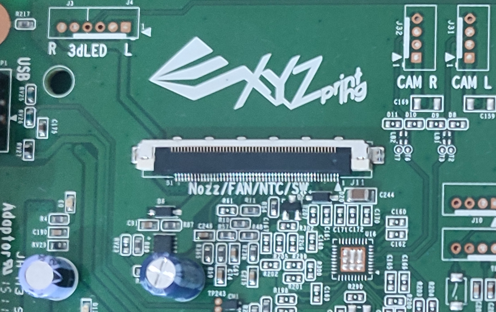
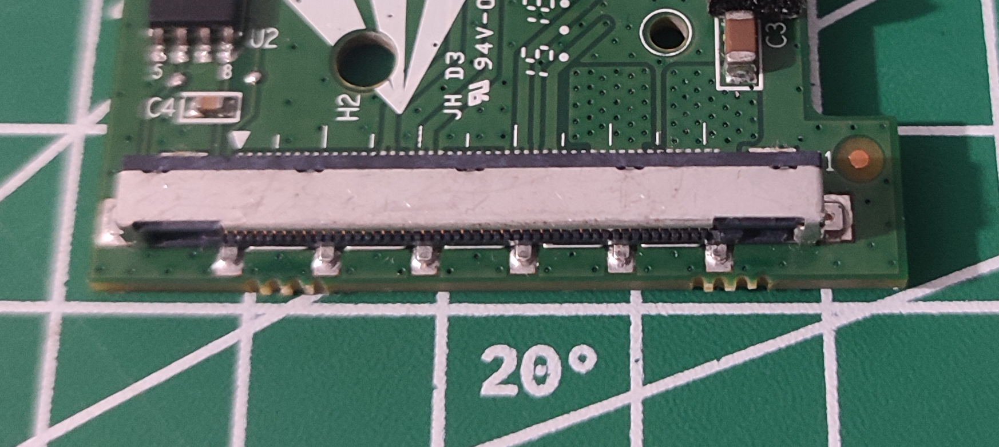
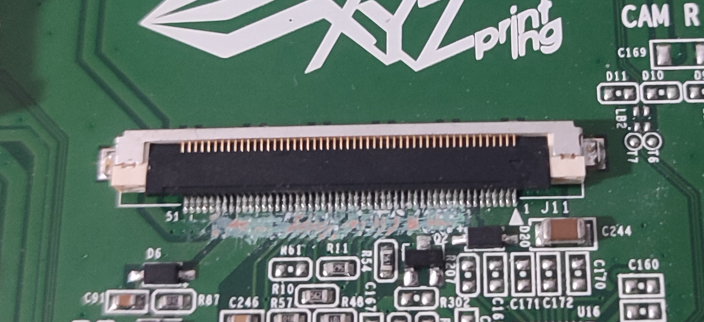
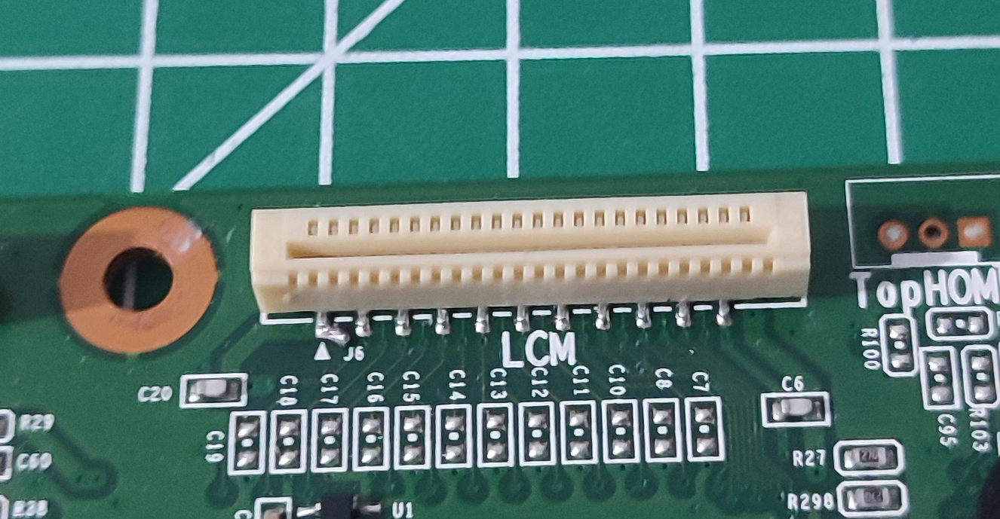
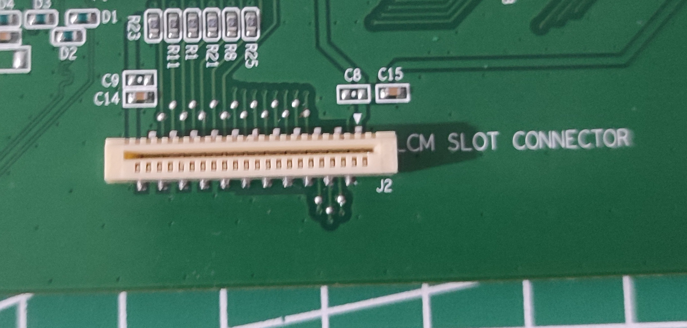
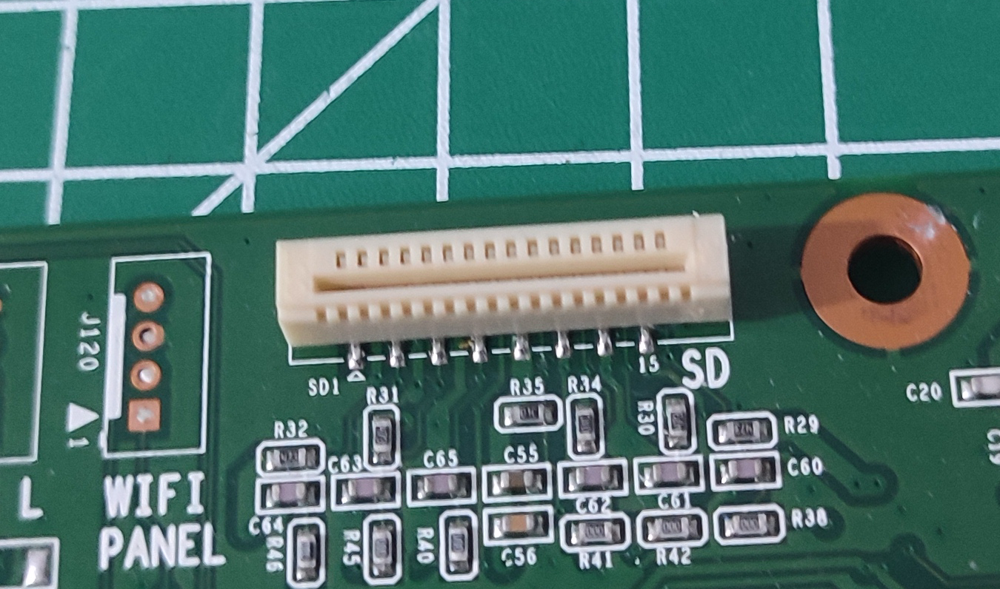
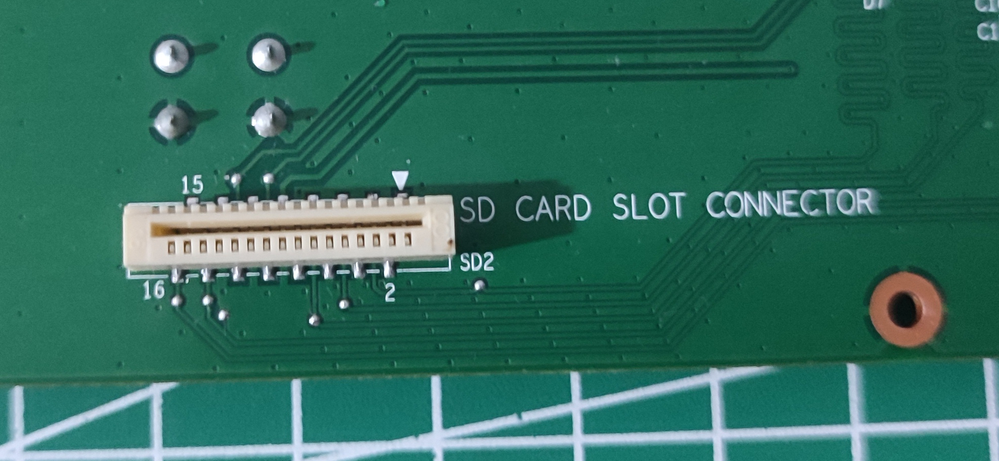

# Connectors

There are 3 main data connectors on the Da Vinci Jr 1.0 board.

- 22-pin LCD connector
- 16-pin SD Card connector
- 51-pin Hotend connector

There are of course a lot more connectors on board, but these are the main ones needing identification.

## 51-pin Hotend connector

The 51-pin Hotend connector connects the main board with the hotend. Its mostly power wires, and a few data wires.

### Photos

| Main board connector                                                              | Sub-board connector                                            |
| --------------------------------------------------------------------------------- | -------------------------------------------------------------- |
|  |  |
|       |                                                                |

## 22-pin LCD connector

The 22-pin LCD connector connects the main board with the sub-board, and carries the LCD display data. It also carries the buttons signals.

### Photos

| Main board connector                                          | Sub-board connector                                         |
| ------------------------------------------------------------- | ----------------------------------------------------------- |
|  |  |

### Pinout

| Pin | MCU     | Pin Desc   | Verified? | Connects To | Description   | Verified? |
| --- | ------- | ---------- | --------- | ----------- | ------------- | --------- |
| 01  | +5V     | Power      | ❌        | 5V          | 5V power      | ✅        |
| 02  | GND     | Ground     | ❌        | GND         | Ground        | ✅        |
| 03  | 111     | PC18       | ❌        | E           | LCD enable    | 🚧        |
| 04  | 82      | PC8        | ❌        | R/W         | LCD R/W       | 🚧        |
| 05  | U1_Pin1 | ???        | ❌        | RS          | LCD RS        | 🚧        |
| 06  | 11      | PC0        | ❌        | D0          | LCD data bus  | 🚧        |
| 07  | 38      | PC1        | ❌        | D1          | LCD data bus  | 🚧        |
| 08  | 39      | PC2        | ❌        | D2          | LCD data bus  | 🚧        |
| 09  | 40      | PC3        | ❌        | D3          | LCD data bus  | 🚧        |
| 10  | 41      | PC4        | ❌        | D4          | LCD data bus  | 🚧        |
| 11  | 58      | PC5        | ❌        | D5          | LCD data bus  | 🚧        |
| 12  | 54      | PC6        | ❌        | D6          | LCD data bus  | 🚧        |
| 13  | 48      | PC7        | ❌        | D7          | LCD data bus  | 🚧        |
| 14  | 90      | PC10       | ❌        | LCD         | LCD backlight | 🚧        |
| 15  | 34      | VDDCORE    | ❌        | ESCAPE      | Home button   | ✅        |
| 16  | 32      | PA21/PGMD9 | ❌        | DOWN        | Down button   | ✅        |
| 17  | 31      | PB3        | ❌        | LEFT        | Left button   | ✅        |
| 18  | 28      | PE5        | ❌        | UP          | Up button     | ✅        |
| 19  | 27      | PE4        | ❌        | RIGHT       | Right button  | ✅        |
| 20  | 25      | PA17/PGMD5 | ❌        | ENTER       | Enter button  | ✅        |
| 21  | GND     | Ground     | ❌        | GND         | Ground        | ✅        |
| 22  | +5V     | Power      | ❌        | 5V          | 5V Power      | ✅        |

## 16-pin SD Card connector

The 16-pin LCD connector connects the main board with the sub-board, and carries the SD card data.

### Photos

| Main board connector                                          | Sub-board connector                                         |
| ------------------------------------------------------------- | ----------------------------------------------------------- |
|  |  |

### Pinout

| Pin | MCU   | Pin Desc          | Verified? | Connects To | Description   | Verified? |
| --- | ----- | ----------------- | --------- | ----------- | ------------- | --------- |
| 01  | -     | Not connected     | ❌        | -           | Not connected | ✅        |
| 02  | GND   | Ground            | ❌        | GND         | Ground        | ✅        |
| 03  | 118   | PA31/MCDA1        | ❌        | DAT1        | SD Card DAT1  | ✅        |
| 04  | GND   | Ground            | ❌        | GND         | Ground        | ✅        |
| 05  | 116   | PA30/MCDA0        | ❌        | DAT0        | SD Card DAT0  | ✅        |
| 06  | GND   | Ground            | ❌        | GND         | Ground        | ✅        |
| 07  | 129   | PA29/MCCK         | ❌        | CLK         | SD Card CLK   | ✅        |
| 08  | +3.3V | Power             | ❌        | +3.3V       | 3.3V Power    | ✅        |
| 09  | +3.3V | Power             | ❌        | +3.3V       | 3.3V Power    | ✅        |
| 10  | 59    | PA25/PGMD13/CTS1  | ❌        | CD          | Card detect   | ✅        |
| 11  | GND   | Ground            | ❌        | GND         | Ground        | ✅        |
| 12  | 112   | PA28/MCCDA        | ❌        | CMD         | SD Card CMD   | ✅        |
| 13  | GND   | Ground            | ❌        | GND         | Ground        | ✅        |
| 14  | 70    | PA27/PGMD15/MCDA3 | ❌        | DAT3        | SD Card DAT3  | ✅        |
| 15  | GND   | Ground            | ❌        | GND         | Ground        | ✅        |
| 16  | 62    | PA28/PGMD14/MCDA2 | ❌        | DAT2        | SD Card DAT2  | ✅        |
