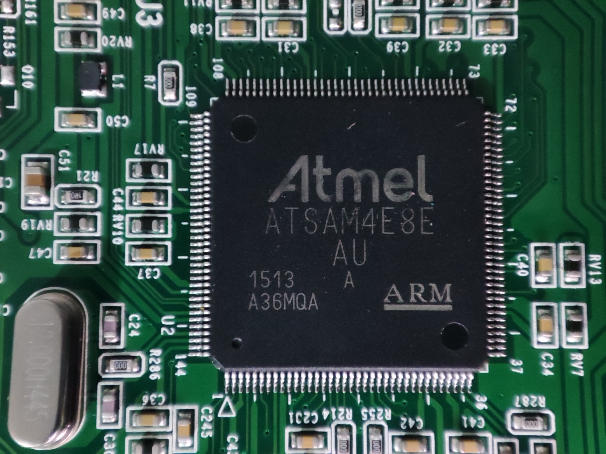
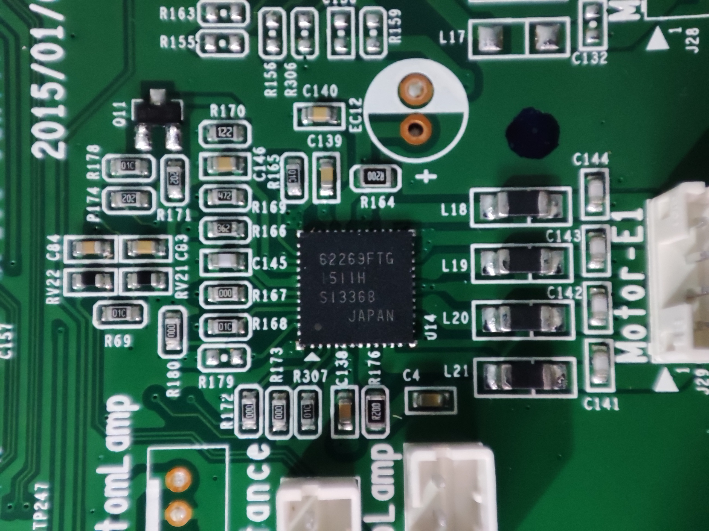
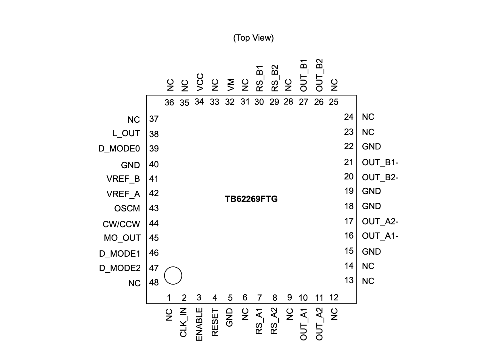
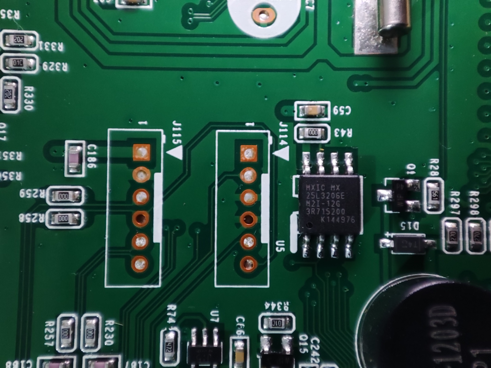
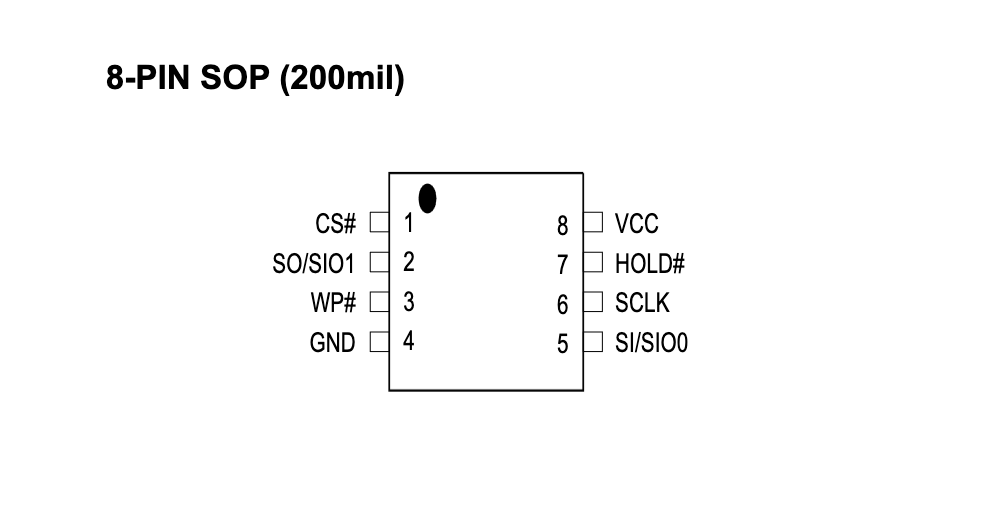

# Controllers and Processing

There are 2 main MCU on board, 4 stepper drivers and 1 flash memory on main board.

- 1x Atmel SAM4E8E MCU
- 1x NXP LPC1115 MCU
- 4x Toshiba TB62269FTG Stepper driver
- 1x Macronix MX25L3206E Flash memory

## Atmel SAM4E8E MCU

Refer to the [Atmel SAM4E Datasheet](https://ww1.microchip.com/downloads/aemDocuments/documents/OTH/ProductDocuments/DataSheets/Atmel-11157-32-bit-Cortex-M4-Microcontroller-SAM4E16-SAM4E8_Datasheet.pdf) for more information.

### Pinouts

It can be found here: [sam4e8e-lqfp-layout.md](../sam4e8e-lqfp-layout.md)

### Photos

144 Pin LQFP package SAM4E8E chip from top-view.
First pin starts on the left of the bottom side, and goes counterclockwise.

Datasheet diagram (no pin numbers):

## NXP LPC1115 MCU

Refer to the [NXP LPC111x Datasheet](https://www.nxp.com/docs/en/data-sheet/LPC111X.pdf) for more information.

### Photos

48 Pin LQFP package LPC1115 chip from top-view.
First pin starts on the left of the bottom side, and goes counterclockwise.

Datasheet diagram with the first pin on top of the left side:

## Toshiba TB62269FTG Driver

Refer to the [Toshiba TB62269FTG Datasheet](https://toshiba.semicon-storage.com/info/TB62269FTG_datasheet_en_20140318.pdf?did=14719&prodName=TB62269FTG) for more information.

### Photos

48 Pin WQFN package TB62269FTG chip from top-view.
First pin starts on the left of the bottom side, and goes counterclockwise.

Datasheet diagram with the first pin on the left of the bottom side:

## Macronix MX25L3206E Flash Memory

Refer to the [Macronix MX25L3206E Datasheet](https://www.mxic.com.tw/Lists/Datasheet/Attachments/8616/MX25L3206E,%203V,%2032Mb,%20v1.5.pdf) for more information.

### Photos

8 Pin SOP package MX25L3206E chip from top-view.
First pin starts on top of the left side, and goes counterclockwise.

Datasheet diagram with the first pin on top of the left side:

