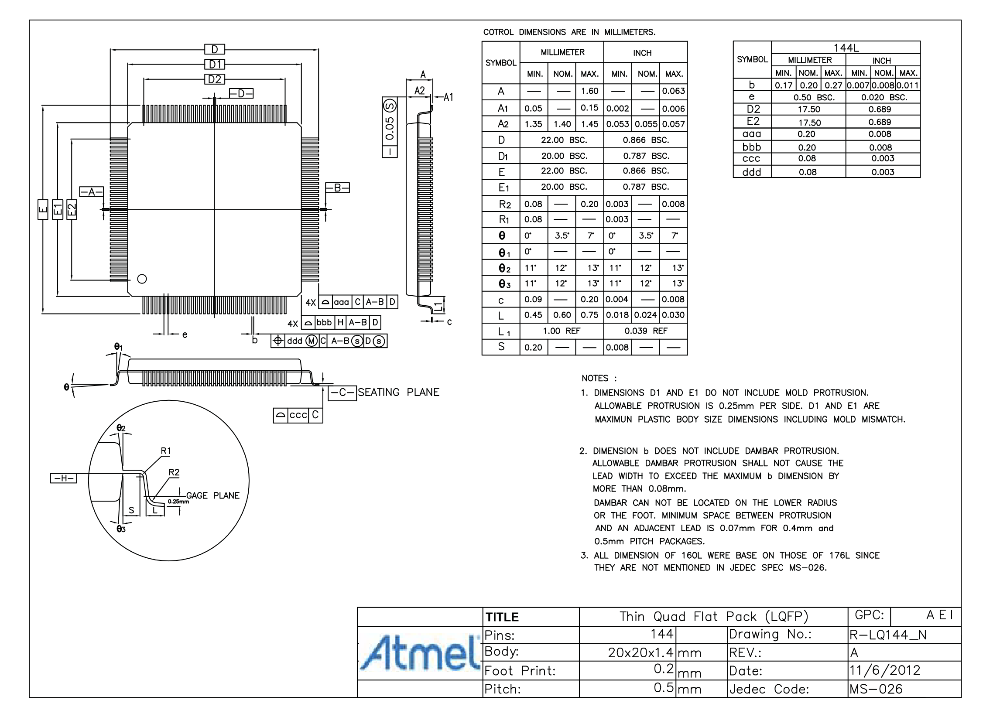
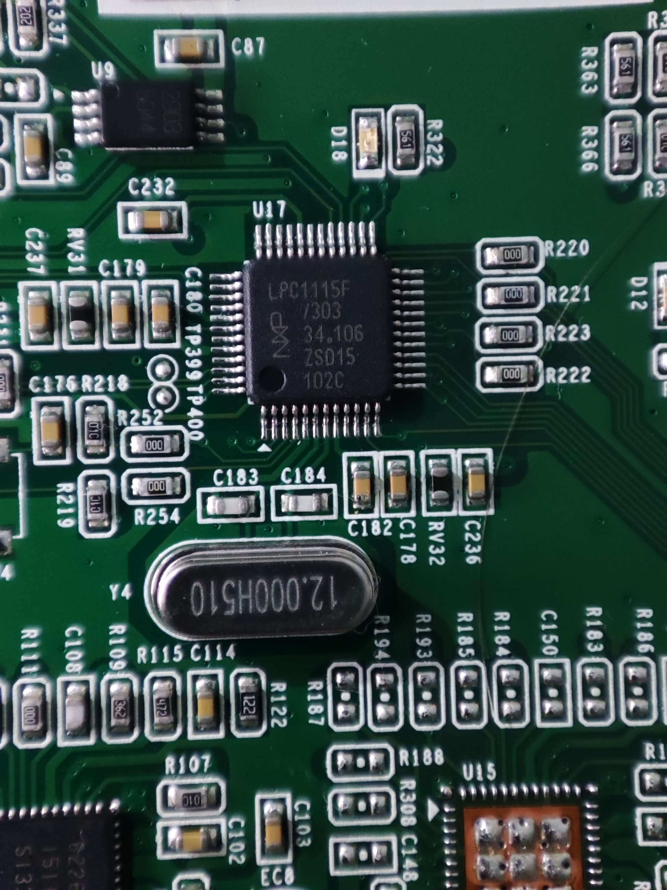
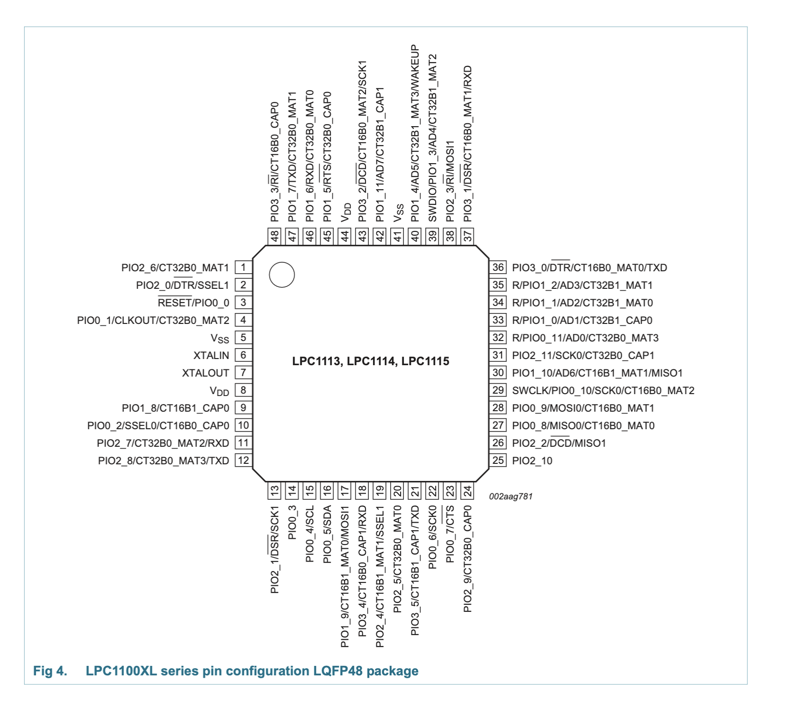

# Controllers and Processing

There are 2 main MCU on board, and 4 stepper drivers. There is 1 Flash memory on the hotend board (?).

- 1x Atmel SAM4E8E MCU
- 1x NXP LPC1115 MCU
- 4x Toshiba TB62269FTG Stepper driver
- 1x Flash memory (no info available for now)

## Atmel SAM4E8E MCU

Refer to the [Atmel SAM4E Datasheet](https://ww1.microchip.com/downloads/aemDocuments/documents/OTH/ProductDocuments/DataSheets/Atmel-11157-32-bit-Cortex-M4-Microcontroller-SAM4E16-SAM4E8_Datasheet.pdf) for more information.

### Pinouts

It can be found here: [sam4e8e-lqfp-layout.md](../sam4e8e-lqfp-layout.md)

### Photos

144 Pin LQFP package SAM4E8E chip from top-view.
First pin starts on the left of the bottom side, and goes counterclockwise.

## NXP LPC1115 MCU

Refer to the [NXP LPC111x Datasheet](https://www.nxp.com/docs/en/data-sheet/LPC111X.pdf) for more information.

### Photos

48 Pin LQFP package LPC1115 chip from top-view.
First pin starts on the left of the bottom side, and goes counterclockwise.

Datasheet diagram (no pin numbers):

## Toshiba TB62269FTG Driver

Refer to the [Toshiba TB62269FTG Datasheet](https://toshiba.semicon-storage.com/info/TB62269FTG_datasheet_en_20140318.pdf?did=14719&prodName=TB62269FTG) for more information.
