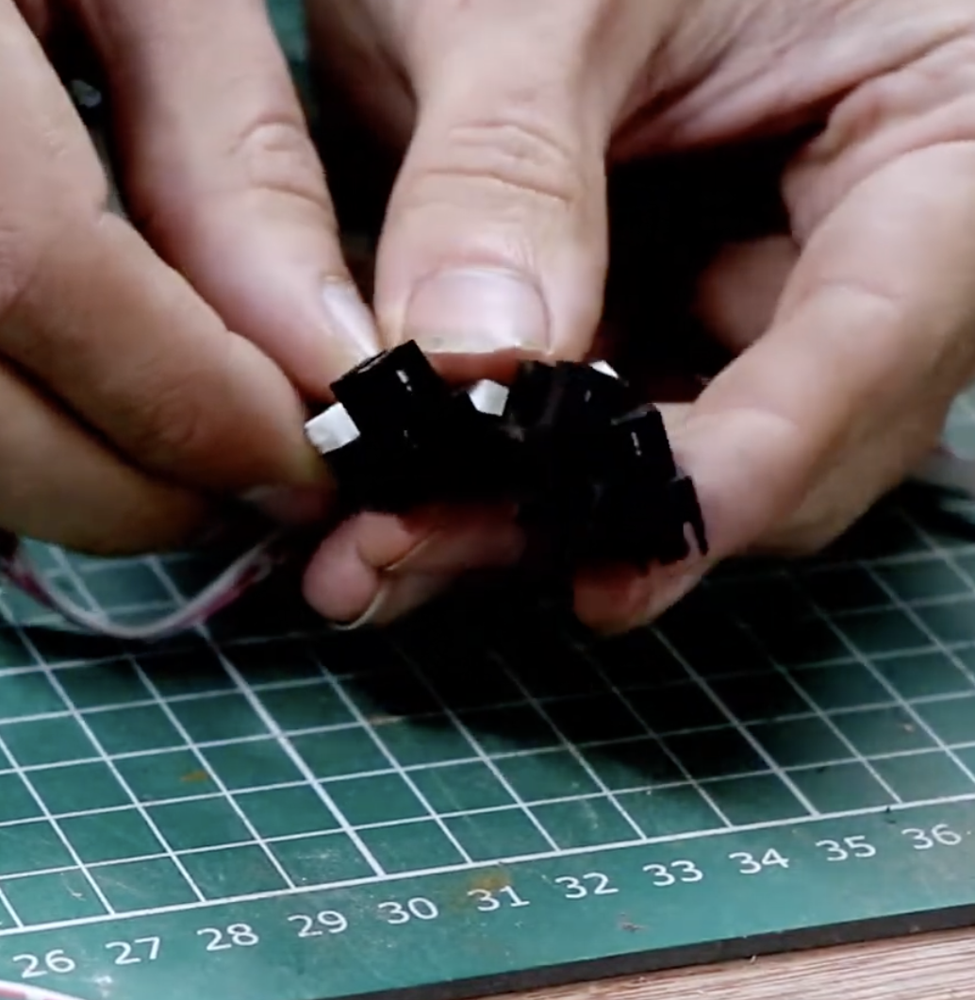

## Optical Endstops

There are 3 optical endstops on the printer. They share one connector labeled "Home Sensor".

| Pin | Type | MCU | Pin Descriptor | PIO type     | Function   |
| --- | ---- | --- | -------------- | ------------ | ---------- |
| 72  | Pin  | 113 | PIO_PD8        | PIO_OUTPUT_0 | X end stop |
| 73  | Pin  | 110 | PIO_PD9        | PIO_OUTPUT_0 | Y end stop |
| 51  | Pin  | 117 | PIO_PC19       | PIO_OUTPUT_0 | Z end stop |

Source: [Luc in Soliforum](https://www.soliforum.com/post/131637/#p131637)

In this photo all the steppers are visible after removal.

