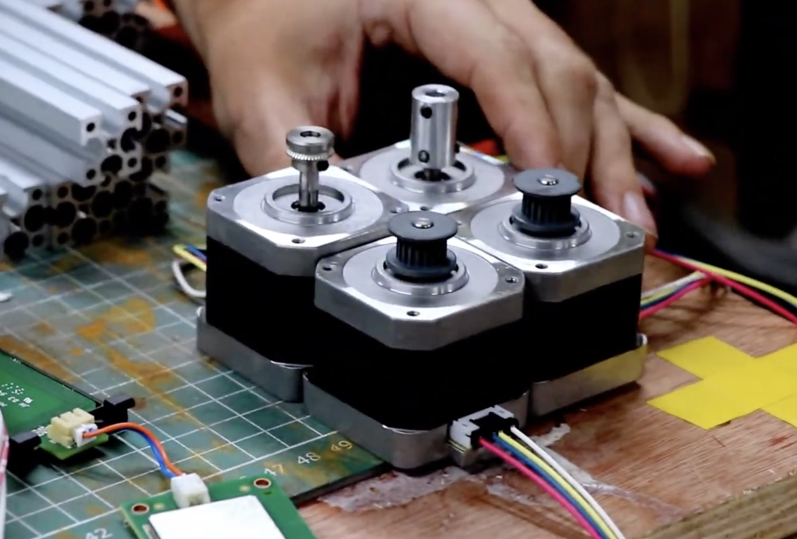
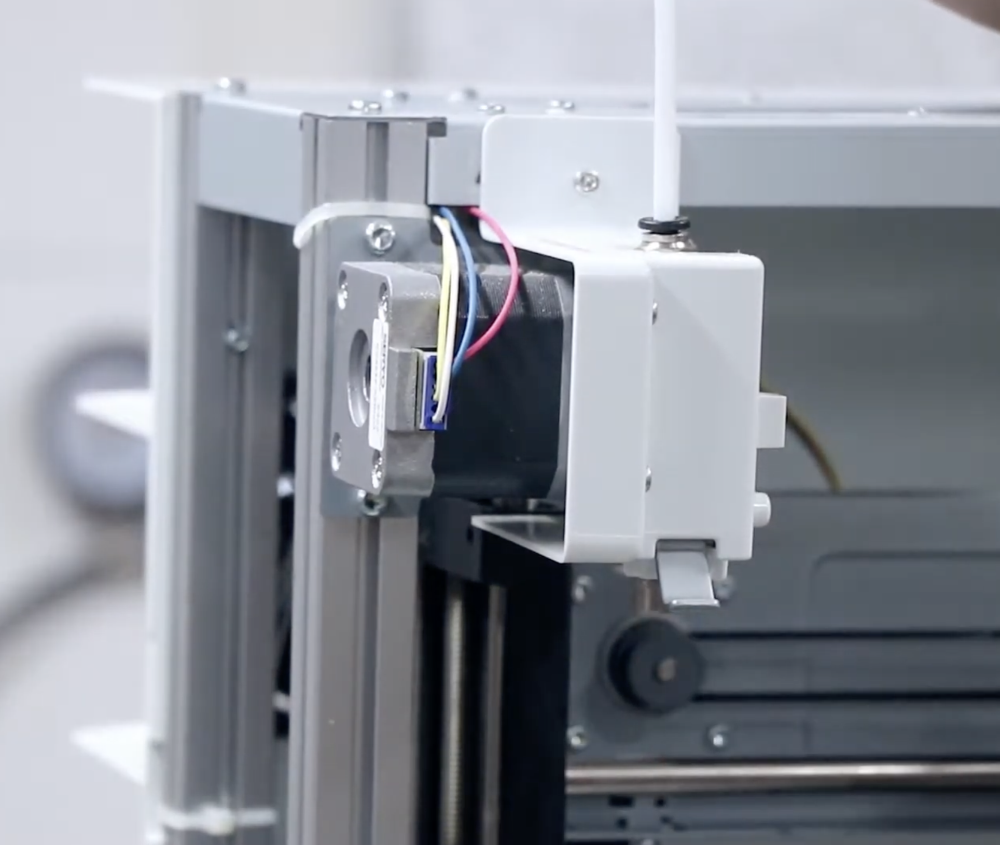
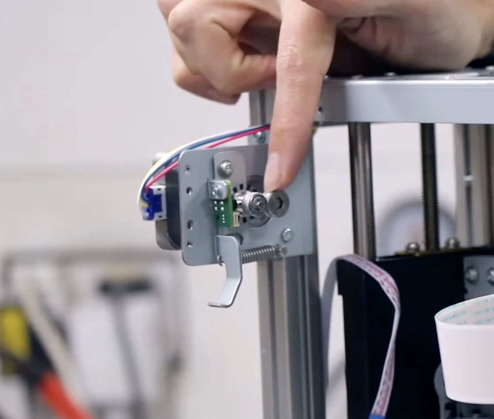

# Stepper Motors

They seem to be Nema 17's. There are 4 of them, one for each axis (X, Y, Z, and E1).

### Pinouts

| Pin Name  | Pin ID | MCU | Pin Desc | Verified? |
| --------- | ------ | --- | -------- | --------- |
| X Enable  |        | 128 | PD3      | ✅        |
| X Step    |        | 127 | PC23     | ✅        |
| X Dir     |        | 126 | PD4      | ✅        |
| Y Enable  |        | 125 | PD5      | ✅        |
| Y Step    |        | 124 | PC22     | ✅        |
| Y Dir     |        | 7   | PE2      | ✅        |
| Z Enable  |        | 121 | PD6      | ✅        |
| Z Step    |        | 120 | PC20     | ✅        |
| Z Dir     |        | 119 | PD7      | ✅        |
| E1 Enable |        | 78  | PD16     | ✅        |
| E1 Step   |        | 76  | PC28     | ✅        |
| E1 Dir    |        | 74  | PD17     | ✅        |

My other findings:

- Drivers are enabled on Enable High
- Drivers are CW on Dir High
- X driver does a full rotation on 3200 steps
- Y driver does a full rotation on 3200 steps
- Z driver does a full rotation on 6400 steps (maybe we can increase the resolution of other motors too?)
- E driver does a full rotation on 3200 steps

### Photos

| In this photo the one on the left is E1, the one in the back is Z, and the other two are Y and X. Y and X seem to have the same head. | X motor is on the left side and moves along the Z axis, and stays parallel to the print bed. |
| ------------------------------------------------------------------------------------------------------------------------------------- | -------------------------------------------------------------------------------------------- |
|                                                                             |                                                      |

| Y motor sits in the middle of the print bed, slightly to the right. It's fixed in the place, and sits perpendicular to the print bed. | Z motor sits parallel to the Y motor, and is also fixed in the place. |
| ------------------------------------------------------------------------------------------------------------------------------------- | --------------------------------------------------------------------- |
|                                                                                               |                               |

| E1 motor sits on the top left side and is perpendicular to the print bed, is fixed in place. | E1 motor from the side view.                |
| -------------------------------------------------------------------------------------------- | ------------------------------------------- |
|                                                  |  |
