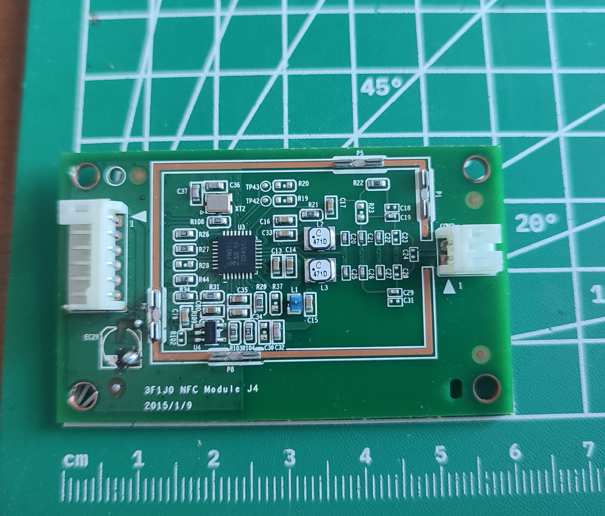
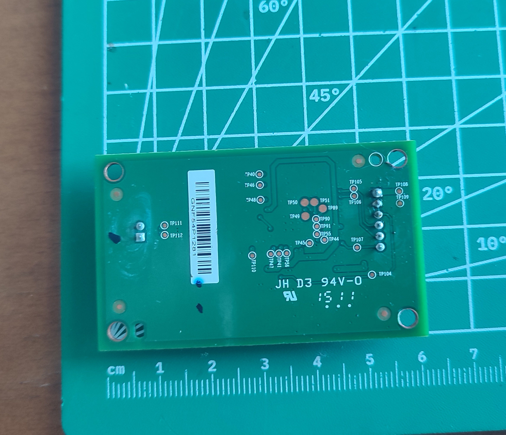
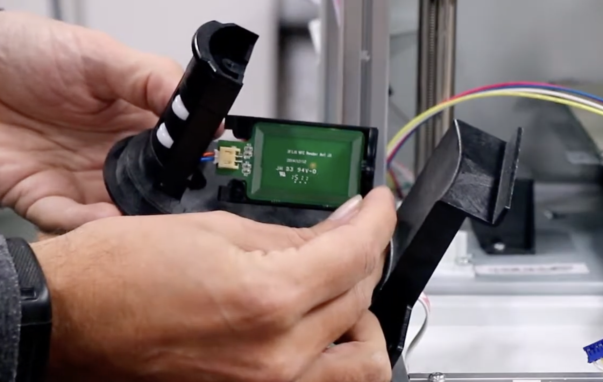
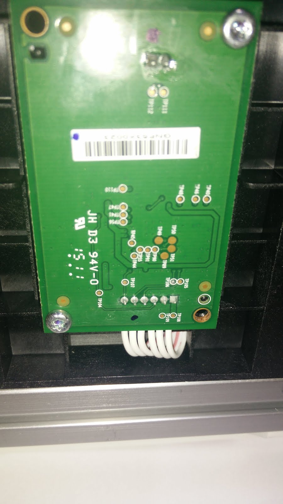
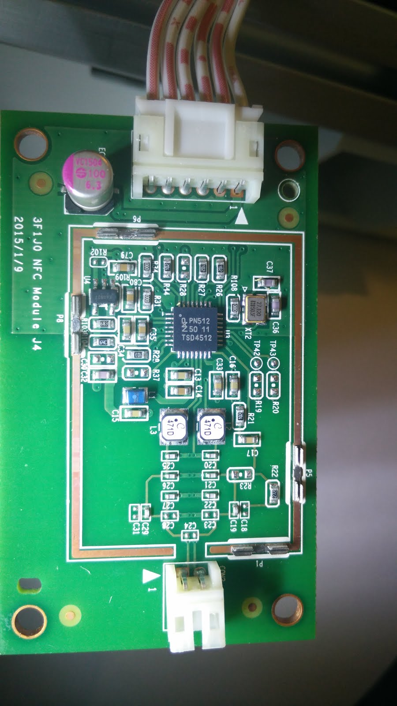
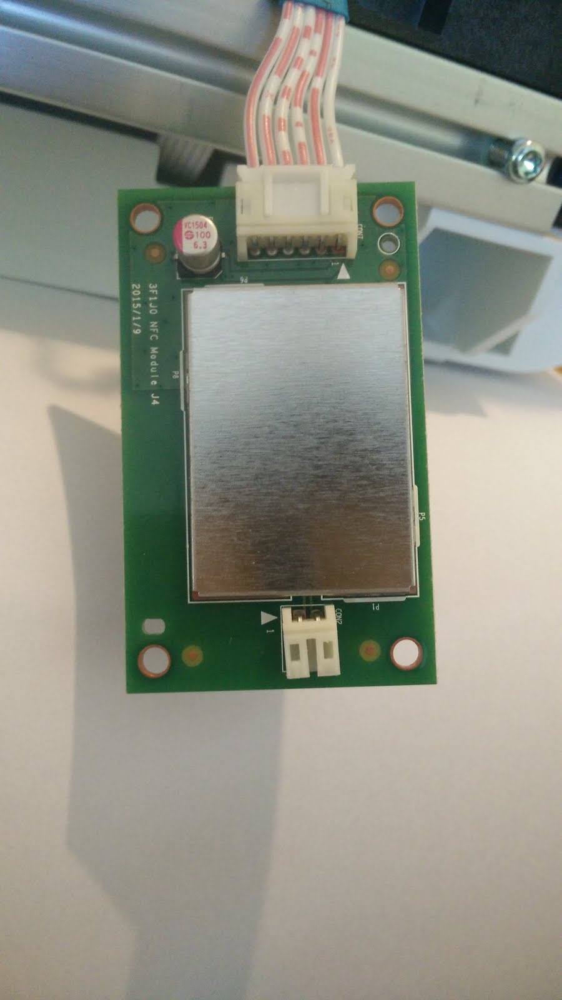
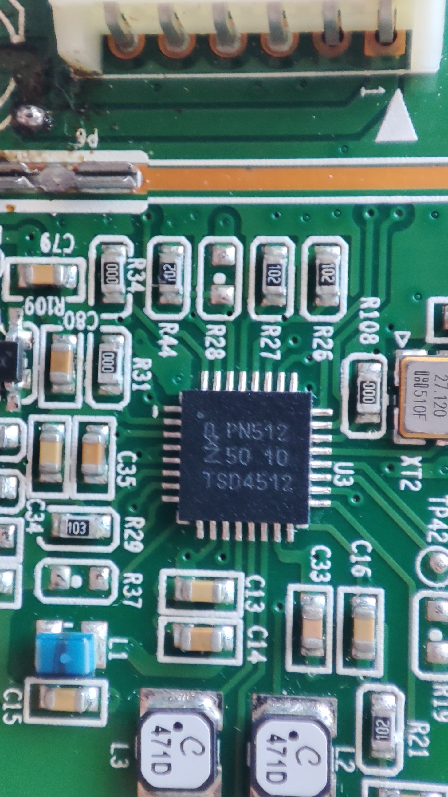
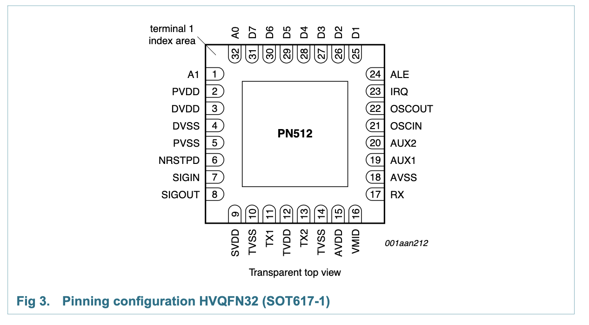

# RFID Reader

I am working on the pinout as the secondary MCU firmware uses it and I need to map the pins.
More details are available [here](https://youtu.be/cn2mYWmanlk?t=556).

The important chip on this board is **PN512 NFC Chip**.

| Front view without the shield                          | Back view of the board                                |
| ------------------------------------------------------ | ----------------------------------------------------- |
|  |  |

| Front view of the board while its mounted (YouTube)        | Back view of the board while its mounted (Reddit)             | Front view of the board while its mounted (YouTube)            | Back view of the board while its mounted (Reddit)             |
| ---------------------------------------------------------- | ------------------------------------------------------------- | -------------------------------------------------------------- | ------------------------------------------------------------- |
|  |  |  |  |

The board is **60mm to 36.5mm** in size. It seems to share the other characteristics of the other PCB's.

### Pinout

The board has a 6 pin connector going to the main board, and a 2 pin antenna connector. We only need the 6 pin connector.

From what i know so far, it probably connects to the secondary MCU.

| Pin | Description | MCU | Pin Desc | Verified? |
| --- | ----------- | --- | -------- | --------- |
| 01  |             |     |          | ❌        |
| 02  |             |     |          | ❌        |
| 03  |             |     |          | ❌        |
| 04  |             |     |          | ❌        |
| 05  |             |     |          | ❌        |
| 06  |             |     |          | ❌        |

## PN512 NFC Chip

Refer to the [NXP PN512 Datasheet](../SOURCES.md#datasheet-nxp-pn512) for more information.

### Pinout

It can be found in the [datasheet](../SOURCES.md#datasheet-nxp-pn512).

### Photos

| 32 Pin HVQFN package PN512 chip from top-view. First pin starts on the top of the left side, and goes counterclockwise | Datasheet diagram                                         |
| ---------------------------------------------------------------------------------------------------------------------- | --------------------------------------------------------- |
|                                                                                  |  |
