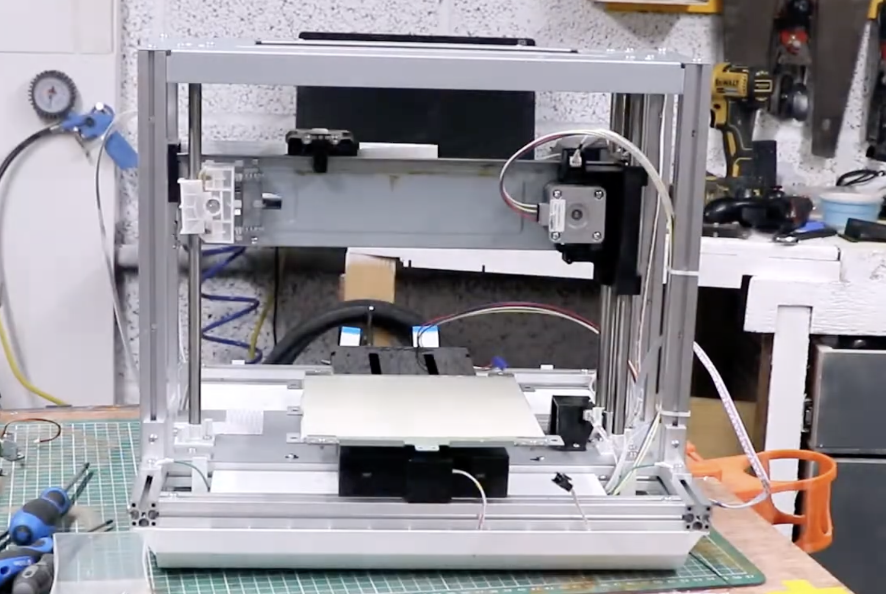
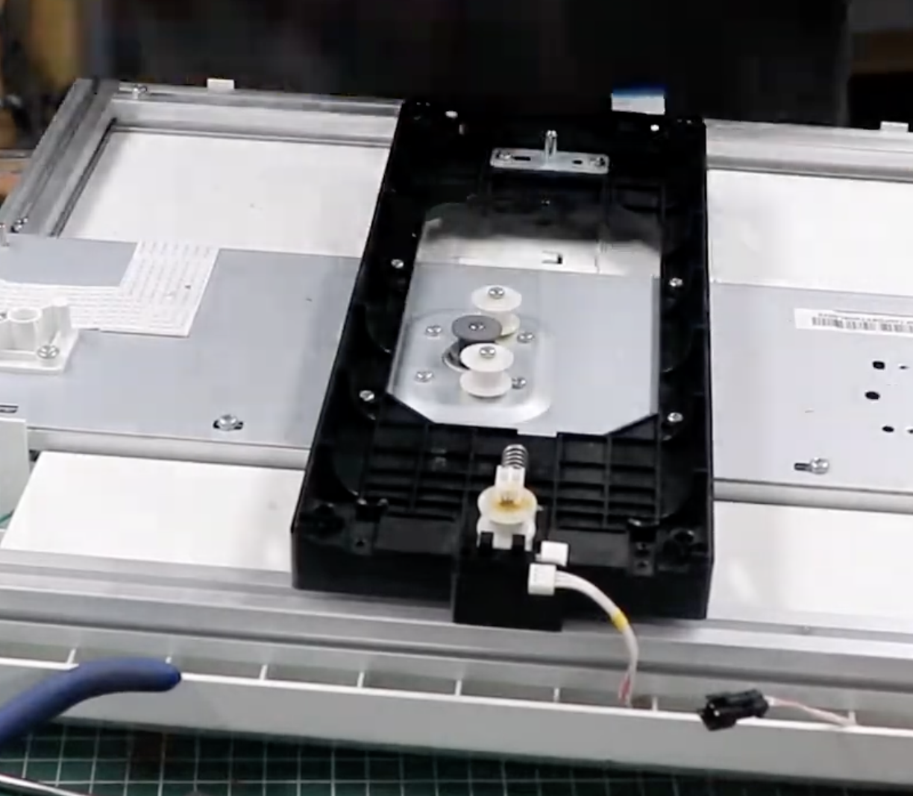

# Stepper Motors

They seem to be Nema 17's. There are 4 of them, one for each axis (X, Y, Z, and E).

## Pinout

| Pin Name  | Driver        | MCU | Pin Desc | Verified? |
| --------- | ------------- | --- | -------- | --------- |
| X Enable  | U10 3 ENABLE  | 128 | PD3      | ✅        |
| X Step    | U10 2 CLK_IN  | 127 | PC23     | ✅        |
| X Dir     | U10 44 CW/CCW | 126 | PD4      | ✅        |
| Y Enable  | U11 3 ENABLE  | 125 | PD5      | ✅        |
| Y Step    | U11 2 CLK_IN  | 124 | PC22     | ✅        |
| Y Dir     | U11 44 CW/CCW | 7   | PE2      | ✅        |
| Z Enable  | U12 3 ENABLE  | 121 | PD6      | ✅        |
| Z Step    | U12 2 CLK_IN  | 120 | PC20     | ✅        |
| Z Dir     | U12 44 CW/CCW | 119 | PD7      | ✅        |
| E1 Enable | U14 3 ENABLE  | 78  | PD16     | ✅        |
| E1 Step   | U14 2 CLK_IN  | 76  | PC28     | ✅        |
| E1 Dir    | U14 44 CW/CCW | 74  | PD17     | ✅        |

My other findings:

- Drivers are enabled on Enable High
- Drivers are CW on Dir High
- X driver does a full rotation on 3200 steps
- Y driver does a full rotation on 3200 steps
- Z driver does a full rotation on 6400 steps (maybe we can increase the resolution of other motors too?)
- E driver does a full rotation on 3200 steps

## Photos

| In this photo the one on the left is E1, the one in the back is Z, and the other two are Y and X. Y and X seem to have the same head. | X motor is on the left side and moves along the Z axis, and stays parallel to the print bed. |
| ------------------------------------------------------------------------------------------------------------------------------------- | -------------------------------------------------------------------------------------------- |
|                                                                  |                                           |

| Y motor sits in the middle of the print bed, slightly to the right. It's fixed in the place, and sits perpendicular to the print bed. | Z motor sits parallel to the Y motor, and is also fixed in the place. |
| ------------------------------------------------------------------------------------------------------------------------------------- | --------------------------------------------------------------------- |
|                                                                                    |                    |

| E motor sits on the top left side and is perpendicular to the print bed, is fixed in place. | E motor from the side view.                           |
| ------------------------------------------------------------------------------------------- | ----------------------------------------------------- |
|                                       |  |
