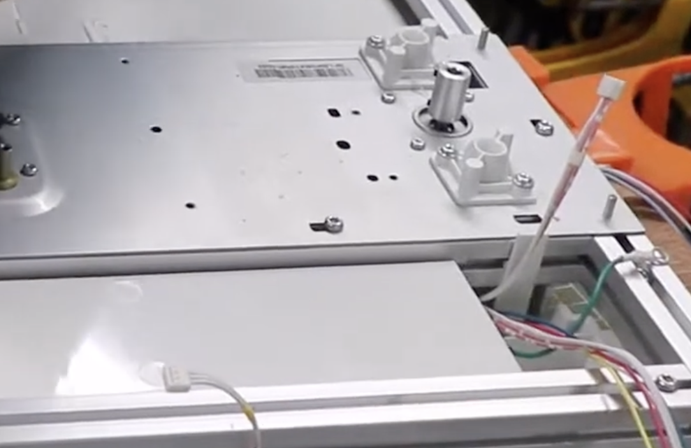

## Stepper Motors

They seem to be Nema 17's. There are 4 of them, one for each axis (X, Y, Z, and E1).

| Pin       | MCU | Pin Desc | Verified? |
| --------- | --- | -------- | --------- |
| X Enable  | 127 | ???      | ❌        |
| X Step    | 128 | ???      | ❌        |
| X Dir     | 126 | ???      | ❌        |
| Y Enable  | 124 | ???      | ❌        |
| Y Step    | 125 | ???      | ❌        |
| Y Dir     | 7   | ???      | ❌        |
| Z Enable  | 121 | PD6      | ✅        |
| Z Step    | 120 | PC20     | ✅        |
| Z Dir     | 119 | PD7      | ❌        |
| E1 Enable | 76  | ???      | ❌        |
| E1 Step   | 78  | ???      | ❌        |
| E1 Dir    | 74  | ???      | ❌        |

Source: [Luc in Soliforum](https://www.soliforum.com/post/131637/#p131637)

In this photo the one on the left is E1, the one in the back is Z, and the other two are Y and X. Y and X seem to have the same head.

X motor is on the left side and moves along the Z axis, and stays parallel to the print bed.

Y motor sits in the middle of the print bed, slightly to the right. It's fixed in the place, and sits perpendicular to the print bed.

Z motor sits parallel to the Y motor, and is also fixed in the place.

E1 motor sits on the top left side and is perpendicular to the print bed, is fixed in place.

